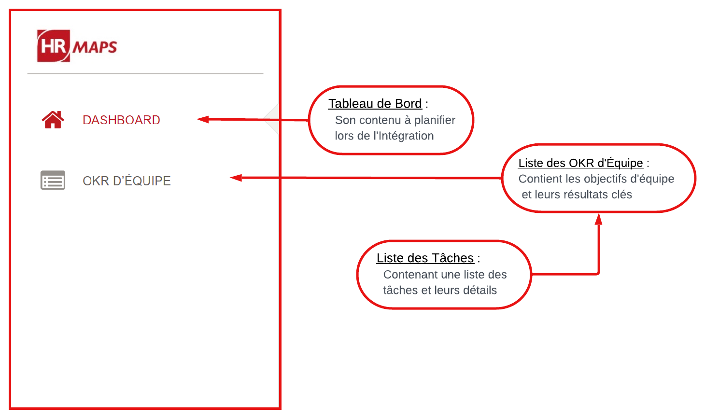

# Dynamic Web Application for Goal Management using the OKR Method

## Overview

This project is a dynamic web application designed for effective goal management using the OKR (Objectives and Key Results) method. The application enables organizations to define, monitor, and manage specific, measurable, achievable, and time-limited objectives, thereby improving employee performance and productivity.

## Features

- **Objective Management:** Create and manage goals with specific objectives and key results.
- **Performance Tracking:** Monitor progress on key results in real-time to ensure goals are on track.
- **User Roles:** Support for different user roles such as Admin, Manager, and Employee.
- **Reporting:** Generate reports on goal achievements and individual performance metrics.
- **Integration:** Seamless integration with existing HR and project management tools.

## Usage

- **Login:** Use your credentials to log in based on your role.
- **Create Objectives:** As a manager, define objectives and assign key results.
- **Track Progress:** Employees can update their progress on key results, and managers can monitor overall goal achievements.
- **Generate Reports:** Generate and download performance reports for analysis.

## Contributors

- **Oueslati Ouala Eddine** & **Amri Siwar**
- **M. Haddar Haythem** (Product Owner)
- **M. Rami Neji** (Team Leader)
- **M. Kdous Wahid** (Academic Supervisor)

## Acknowledgments

- Special thanks to HRMaps / Square IT for hosting and supporting this project.
- Thanks to all the team members who contributed to the development and success of this application.

## Screenshots

### Login Interface

### Barre Menu Manager

| **Gérer l'OKR d'Entreprise** | **Gérer l'OKR d'Équipe** | **Gérer les Résultats Clés** |
|------------------------------|--------------------------|------------------------------|
| **Ajouter Objet Entreprise**  | **Consulter Objet Équipe** | **Ajouter Résultat Clé** |
|  |  |  |
| **Archiver Objet Entreprise**  | **Ajouter Objet Équipe** | **Ajouter Résultat Clé Équipe** |
|  |  |  |
| **Consulter Objet Entreprise** | **Archiver Objet Équipe** | **Consulter Résultat Clé Entreprise** |
|  |  |  |
| **Modifier Objet Entreprise** | **Consulter KR Attribués** | **Consulter Résultat Clé Équipe** |
|  |  |  |
| **Supprimer Objet Entreprise** | **Modifier Objet Équipe** | **Modifier Résultat Clé** |
|  |  |  |
| | **Supprimer Objet Équipe** | **Modifier Résultat Clé Équipe** |
| |  |  |
| | | **Supprimer Résultat Clé** |
| | |  |

